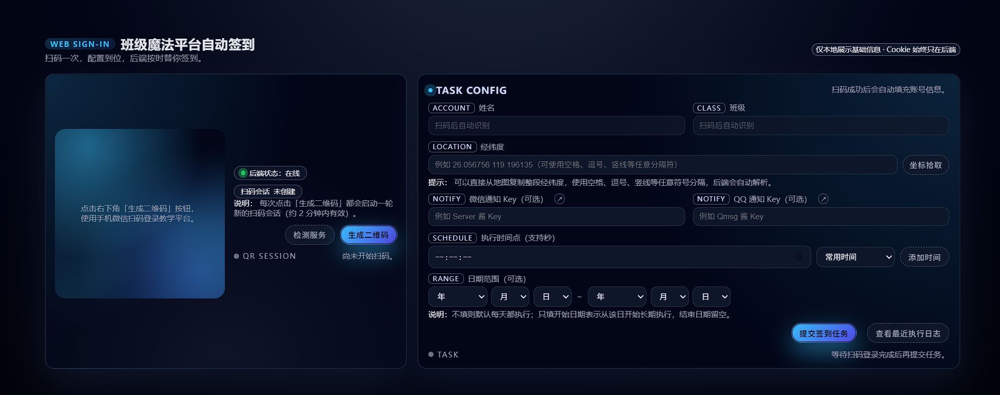
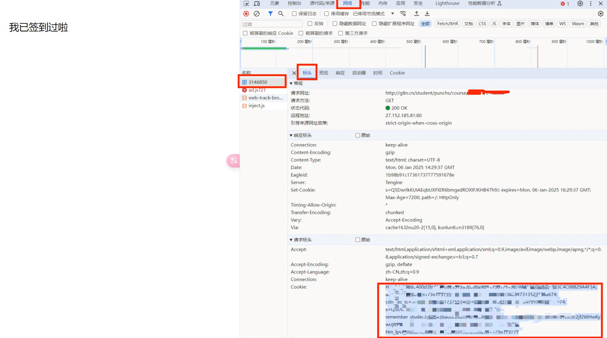

# BJMFSign · 班级魔方 GPS 自动签到

班级魔方（g8n.cn）多人 GPS 自动签到工具。现以 **Android 原生 App** 为主要入口，同时保留原 Python 脚本与 Web 管理端源码。

- 仅支持 GPS 签到（可在范围外），根据自己学校的签到需求进行了简化
- 可配置多人签到
- 可配置 QQ / 微信通知签到结果
- 如果你觉得好用，`Please Star` orz



## 致谢

- 本项目基于 [JasonYANG170/AutoCheckBJMF](https://github.com/JasonYANG170/AutoCheckBJMF) 修改简化而来，感谢原作者的工作。
- 原项目支持更多签到方式与功能，如有需要请前往 [AutoCheckBJMF](https://github.com/JasonYANG170/AutoCheckBJMF) 查看。

## 功能

- 微信扫码登录，自动获取 Cookie 与班级信息
- 自动从指定课程中获取签到项，模拟表单提交完成 GPS 签到
- 多人任务管理，按设定时间自动签到，也可手动执行
- 签到结果通过 QQ（Qmsg酱）/ 微信（Server酱）推送（可选）
- 本地日志查看

## Android App（主要入口）

`android-app/` 是 Android 原生客户端，使用 Kotlin + Jetpack Compose + Miuix 组件风格，实现扫码登录、任务配置、自动/手动签到、日志查看和 QQ/WX 通知。App 内部直接移植了原 Python/Web 签到逻辑，**不依赖 `web_signin` 后端服务**，也不需要 `data.json` / `.env`。

### 下载安装

Release APK 由 GitHub Actions 自动构建：

1. 打开仓库的 [Actions → Android Release APK](https://github.com/bai-piao/BJMFSign/actions/workflows/android-release.yml)。
2. 选择最新一次成功的运行，在页面底部 **Artifacts** 中下载 `BJMFSign-release-apk`（需登录 GitHub）。
3. 解压得到 `.apk`，传到手机安装（需允许“安装未知来源应用”）。

> 每次推送 `android-app/` 相关改动到仓库都会自动构建，也可以在 Actions 页面点击 **Run workflow** 手动触发。

### 使用流程

1. 在 App 内获取二维码，使用微信扫码登录。
2. 填写经纬度、定位精度、执行时间和通知 Key，保存为本机任务。
3. App 会通过 Android `AlarmManager` 安排下一次自动签到；也可以在任务页手动执行单个任务，或在“管理”页执行全部已启用任务。
4. Android 12+ 如限制精确定时，请在系统设置中允许本 App 的闹钟/提醒权限。

### APK 签名

- 未配置签名 Secrets 时，CI 每次会生成临时签名密钥，**不同构建之间签名不同，覆盖安装前需先卸载旧版本**。
- 如需固定签名（支持直接覆盖升级），在仓库 **Settings → Secrets and variables → Actions** 中添加：

  | Secret | 说明 |
  | --- | --- |
  | `RELEASE_KEYSTORE_BASE64` | keystore 文件的 base64 内容（`base64 -w0 release.jks`） |
  | `RELEASE_STORE_PASSWORD` | keystore 密码 |
  | `RELEASE_KEY_ALIAS` | key 别名 |
  | `RELEASE_KEY_PASSWORD` | key 密码 |

  生成 keystore 示例：
  ```bash
  keytool -genkeypair -v -keystore release.jks -alias bjmf \
    -keyalg RSA -keysize 2048 -validity 10000
  ```

### 本地构建

1. 用 Android Studio 打开 `android-app/`（需 Android SDK Platform 37，JDK 17+）。
2. 直接运行 `app` 模块到手机或模拟器；或执行 `./gradlew assembleRelease` 构建 release 包。
3. 本地构建 release 时，若设置了 `RELEASE_STORE_FILE`、`RELEASE_STORE_PASSWORD`、`RELEASE_KEY_ALIAS`、`RELEASE_KEY_PASSWORD` 环境变量则使用该签名，否则回退到本机 debug keystore。

### 关键源码

- 主入口：`android-app/app/src/main/java/com/bjmf/sign/android/MainActivity.kt`
- 签到网络逻辑：`android-app/app/src/main/java/com/bjmf/sign/android/data/BjmfNativeService.kt`
- 本地任务与日志：`android-app/app/src/main/java/com/bjmf/sign/android/data/BjmfStore.kt`
- 定时执行：`android-app/app/src/main/java/com/bjmf/sign/android/data/BjmfScheduler.kt`
- UI 依赖：`top.yukonga.miuix.kmp:miuix-ui:0.9.2`；`compileSdk` 37，`targetSdk` 36

## 代码结构

```
BJMFSign/
├── android-app/            # Android 原生客户端（主要入口）
├── .github/workflows/      # GitHub Actions：自动构建 release APK
├── BJMF.py                 # 旧 Python 脚本主程序，负责整体流程控制
├── auto_add_user.py        # 微信扫码获取用户信息并写入 data.json
├── utils/                  # Python 工具模块
│   ├── config_manager.py   # 配置文件读取与保存
│   ├── user_info.py        # 用户信息与班级信息获取
│   ├── notification.py     # QQ / 微信消息发送
│   └── attendance.py       # 签到任务核心逻辑
├── web_signin/             # Web 管理端（历史保留）
└── doc/                    # 文档图片
```

## 旧 Python 脚本配置（可选保留）

下面是原脚本的历史使用方式，Android App 不依赖 `data.json`、`.env` 或 `web_signin` 服务。如仍需运行旧脚本，请先安装依赖：

```bash
pip install -r requirements.txt
```

### 方法一：自动添加用户 (推荐)

最简单的方法，无需手动抓包或查找 Cookie。

1. **(可选) 配置公共参数**：
   在项目根目录下创建 `.env` 文件（可参考下方模板），填入经纬度等公共信息。
   ```properties
   # 是否启用公共配置 (True/False)
   ENABLE_COMMON_CONFIG=True

   # 公共配置参数
   COMMON_LAT=xxxxxx  # 纬度
   COMMON_LNG=xxxxxx  # 经度
   COMMON_ACC=30      # 精度
   COMMON_QMSG_KEY=   # Qmsg推送Key(可选)
   COMMON_WX_KEY=     # Server酱推送Key(可选)
   ```

2. **运行自动工具**：
   ```bash
   python auto_add_user.py
   ```

3. **扫码登录**：
   使用微信扫描弹出的二维码，程序会自动获取 Cookie 和班级信息并保存到 `data.json`。

### 方法二：手动配置 (高级)

如果你需要手动配置 `data.json`，可以按照以下步骤获取参数。

#### 1. data.json 格式
```json
{
    "students": [
        {
            "name": "用户备注",
            "class": "110141",
            "lat": "30.123456",
            "lng": "120.123456",
            "acc": "30",
            "cookie": "从浏览器获取的Cookie字符串",
            "QmsgKEY": "",
            "WXKey": ""
        }
    ]
}
```

#### 2. 参数获取说明

- **Cookie 获取方法 (PC端浏览器)**：
  1. 电脑微信登录并打开签到页面：`http://g8n.cn/student/login?ref=%2Fstudent`
  2. 按 `F12` 打开开发者工具，切换到 **网络 (Network)** 标签。
  3. 刷新页面，在左侧请求列表中找到第一个请求（通常是数字或 student）。
  4. 点击该请求，在右侧 **标头 (Headers)** -> **请求标头 (Request Headers)** 中找到 `Cookie`。
  5. 复制 `Cookie:` 后面的所有内容（通常以 `PHPSESSID=...` 或 `remember_student_...` 开头）。
  
  

- **Class (班级ID)**：
  - 在上述浏览器页面的网址栏中，可以看到类似 `course/110141` 的内容，`110141` 即为班级ID。
  - 或者在页面中查看。
  

- **经纬度 (Lat/Lng)**：
  - 使用 [高德地图坐标拾取器](https://lbs.amap.com/tools/picker) 获取。

- **推送 Key (可选)**：
  - **Qmsg酱**: [官网](https://qmsg.zendee.cn/) 注册获取 Key。
  - **Server酱**: [官网](https://sct.ftqq.com/) 扫码获取 Key。

## 旧 Python 脚本使用方法（可选）

1. **配置用户**：使用上述任意一种方法完成用户配置（生成 `data.json`）。
2. **执行签到**：
   ```bash
   python BJMF.py
   ```
3. **自动化运行**：
   - **Windows**: 使用"任务计划程序"设置定时任务。
   - **Linux**: 使用 `crontab` 设置定时任务。
   - **云函数**: 可部署至云函数平台。

## 文件与隐私说明

- `data.json`、`.env` 等文件中包含个人 Cookie、经纬度、推送 Key 等敏感信息，**不会被提交到 Git 仓库**（已在 `.gitignore` 中忽略），请妥善保管本地副本并做好备份。
- `web_signin/` 目录下的本地数据库文件 `web_signin/db/web_signin.db` 也已默认加入 `.gitignore`，仅用于本地运行和调试，不会上传到远程仓库。
- 如需分享或上传日志/截图，请注意**手动打码或删除其中的 Cookie、班级 ID、经纬度等个人隐私信息**。

## web_signin Web 管理端（历史保留）

`web_signin/` 目录仍保留原 Web 管理端源码，方便回看或继续维护旧实现。新版 Android App 已内置登录、任务、签到、日志和通知能力，无需另行启动任何后端服务。

## 注意事项

- 程序会自动检测并填充空的 class 字段。
- 签到二维码/Cookie 具有时效性，如果签到失败（提示 Cookie 无效），请重新运行 `auto_add_user.py` 更新凭证。

## 更新说明

- 2026.10.09
  - 新增 GitHub Actions 工作流，自动构建可安装的 release APK
  - Android release 构建支持通过环境变量 / 仓库 Secrets 配置签名
  - README 重写为以 Android App 为主

- 2026.01.10
  - `auto_add_user.py` 优化: 支持通过 `.env` 文件配置公共参数(经纬度、通知Key等)，简化配置流程
  - `auto_add_user.py` 优化: 增加二维码自动清理机制，避免垃圾文件堆积及文件占用问题
  - `utils/attendance.py` 修复: 优化签到状态检测逻辑，增加对"已签到"状态的HTML解析，解决正则匹配失败导致的误报问题

- 2025.12.15
  - 更新 `utils/attendance.py` ,改用 requests.Session()防止获取签到项失败问题；同时增加了对 response.url 的检测

- 2025.12.04 v2版本
  - 新增 `auto_add_user.py` 工具，实现微信扫码自动获取用户信息并写入配置文件data.json
  - 简化了用户添加流程，无需手动获取Cookie和班级ID
